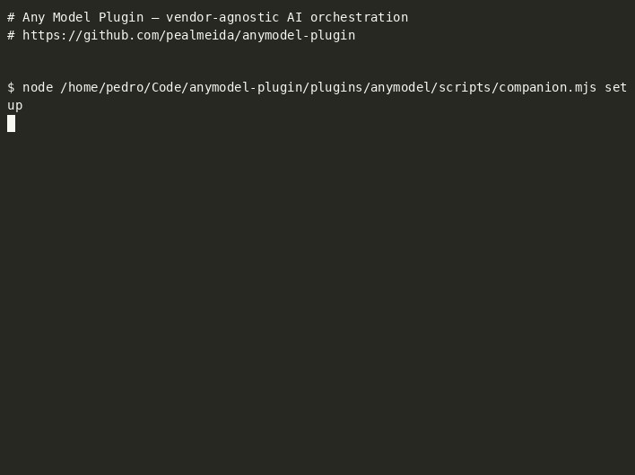

<div align="center">
  
  <h1>Any Model Plugin</h1>
  <p><strong>Any agent. Any provider. Any model.</strong></p>
  <p>Delegate tasks and run adversarial reviews from any AI agent to any provider and model.</p>
  <p>
    <a href="LICENSE"></a>
    <a href="https://github.com/pealmeida/anymodel-plugin/actions/workflows/ci.yml"></a>
    <a href="package.json"></a>
    <a href="https://pealmeida.github.io/anymodel-plugin/"></a>
    <a href="https://github.com/pealmeida/anymodel-plugin/releases"></a>
  </p>
  
</div>

Any Model Plugin separates the _executor harness_ (the agent runtime that plans, runs commands, and edits files) from the _model_ (the provider the harness thinks with). Pick the best engine for the job and the best model for the task — independently.

### Why

**Stop being locked into one AI provider.** Most agent tools hardwire you to a single model vendor. Any Model Plugin is the **universal remote for AI agents** — delegate tasks to any engine, route through any provider, and run adversarial reviews where a _different_ model challenges the implementation before you ship. Vendor-agnostic by design, zero dependencies, one core.

---

## Table of contents

- [Features](#features)
- [Quick start](#quick-start)
- [Usage](#usage)
  - [Claude Code plugin](#claude-code-plugin)
  - [Universal CLI](#universal-cli)
  - [MCP server](#mcp-server)
- [Commands](#commands)
- [Engines](#engines)
- [Providers](#providers)
- [Configuration](#configuration)
- [Documentation](#documentation)
- [Roadmap](#roadmap)
- [Contributing](#contributing)
- [Attribution](#attribution)
- [Security](#security)
- [License](#license)

## Features

- **Multi-engine delegation** — run tasks through Codex, Claude, or the built-in `direct` agent loop
- **Multi-provider routing** — use Z.AI GLM, Ollama Cloud, OpenCode Go, or add your own via `registry.toml`
- **Adversarial reviews** — challenge your implementation with a different model before shipping
- **Background jobs** — delegate long-running tasks and check `status` / `result` / `cancel`
- **Three access surfaces** — Claude Code slash commands, universal CLI, or MCP server (Cursor, Windsurf, VS Code, Codex)
- **Zero dependencies** — pure ESM, Node.js standard library only
- **Built-in wire shim** — translates the engine's Responses API to any provider's chat-completions, with a quirk pipeline for provider-specific fixes

## Quick start

**Prerequisites:** Node.js ≥ 18.18 (`node --version`). No `npm install` — zero dependencies.

**One-line install (Claude Code):**

```bash
git clone https://github.com/pealmeida/anymodel-plugin.git && cd anymodel-plugin && claude plugin marketplace add . && claude plugin install anymodel@any-model
```

### 1 · Claude Code plugin

```bash
git clone https://github.com/pealmeida/anymodel-plugin.git
cd anymodel-plugin
claude plugin marketplace add .
claude plugin install anymodel@any-model
```

### 2 · Universal CLI (no install)

```bash
node plugins/anymodel/scripts/companion.mjs setup
```

### 3 · MCP server (Cursor, Windsurf, VS Code, Codex, Claude)

Add to your host's MCP config:

```json
{
  "mcpServers": {
    "anymodel": {
      "command": "node",
      "args": ["/absolute/path/to/anymodel-plugin/plugins/anymodel/scripts/mcp-server.mjs"]
    }
  }
}
```

### Provider API keys

```bash
export ZAI_API_KEY="your-key"
export OLLAMA_API_KEY="your-key"
export OPENCODE_API_KEY="your-key"
```

Or load from a file:

```bash
export ANYMODEL_ENV_FILE="$HOME/.anymodel.env"
```

### Verify

```
/anymodel:setup
/anymodel:models
```

### First delegation

```
/anymodel:delegate --engine direct --model zai/glm-5.2 "explain the architecture of this project"
```

> **AI agents:** every turn command accepts `--json` for machine-readable output. Use
> `setup --json` to check readiness, `models --json` to list available models, and
> `delegate --json` to capture results programmatically. The MCP server exposes the same
> surface as 8 tools — see [INTEGRATIONS.md](INTEGRATIONS.md) for per-host wiring.

## Usage

### Claude Code plugin

Once installed, 11 slash commands are available:

```
/anymodel:delegate           Delegate a task to any engine and model
/anymodel:review             Run a code review against local git state
/anymodel:adversarial-review Challenge the implementation approach and design choices
/anymodel:choose             Interactive chain: pick action, provider, model, then dispatch
/anymodel:delegate-with      Delegate with guided provider/model selection
/anymodel:review-with        Adversarial review with guided provider/model selection
/anymodel:models             Probe configured providers for available models
/anymodel:setup              Check engine and provider setup
/anymodel:status             Show active and recent jobs
/anymodel:result             Show a finished job's output
/anymodel:cancel             Cancel an active background job
```

**Delegate a task:**

```
/anymodel:delegate --engine codex --model zai/glm-5.2 --write "fix the flaky auth test"
/anymodel:delegate --engine claude "refactor the error handling in src/api"
/anymodel:delegate --engine direct --model ollama/qwen3-coder "add unit tests for the parser"
```

**Run a review:**

```
/anymodel:review --base main
/anymodel:review --engine claude --scope working-tree
/anymodel:adversarial-review "check for race conditions in the connection pool"
```

**Guided selection chains:**

```
/anymodel:choose delegate with zai fix the flaky test
/anymodel:delegate-with ollama implement the parser guard
/anymodel:review-with opencode-go --base main challenge the architecture
```

### Universal CLI

The same CLI powers every surface. Run it from any shell, CI pipeline, or agent:

```bash
COMPANION="plugins/anymodel/scripts/companion.mjs"

# Delegate a task
node "$COMPANION" delegate --engine direct --model zai/glm-5.2 "explain this codebase"

# Run a review
node "$COMPANION" review --base main

# Adversarial review with focus text
node "$COMPANION" adversarial-review "audit auth and session handling"

# Check available models
node "$COMPANION" models

# Verify setup
node "$COMPANION" setup

# Job management
node "$COMPANION" status
node "$COMPANION" result <job-id>
node "$COMPANION" cancel <job-id>
```

All turn commands accept `--json` for machine-readable output.

### MCP server

Expose all capabilities as MCP tools in any MCP-compatible host:

```json
{
  "mcpServers": {
    "anymodel": {
      "command": "node",
      "args": ["/absolute/path/to/anymodel-plugin/plugins/anymodel/scripts/mcp-server.mjs"]
    }
  }
}
```

Supported hosts: Claude Code, Codex CLI, Cursor, Windsurf, VS Code. See [INTEGRATIONS.md](INTEGRATIONS.md) for per-host configuration details.

The MCP server exposes 8 tools: `delegate`, `review`, `adversarial_review`, `status`, `result`, `cancel`, `models`, `setup`.

## Commands

| Command | Description | Key flags |
|---------|-------------|-----------|
| `delegate` | Delegate a task to an engine | `--engine`, `--model`, `--write`, `--background`, `--resume` |
| `review` | Run a code review | `--engine`, `--model`, `--base`, `--scope` |
| `adversarial-review` | Challenge implementation choices | `--engine`, `--model`, `--base`, `--scope`, focus text |
| `choose` | Interactive action/provider/model chain | `--engine`, `--write` |
| `delegate-with` | Delegate with guided model selection | `--engine`, `--bridge`, `--write` |
| `review-with` | Adversarial review with guided model selection | `--engine`, `--base`, `--scope` |
| `models` | Probe provider model lists | `--provider` |
| `setup` | Check engine/provider readiness | `--json` |
| `status` | Show active/recent jobs | `--all`, `--json` |
| `result` | Show finished job output | `--json` |
| `cancel` | Cancel an active job | `--json` |

## Engines

The **executor harness** — the agent runtime that plans, runs commands, and edits files.

| Engine | Harness | Sandbox | Native review | Resume | Requires |
|--------|---------|---------|---------------|--------|----------|
| `codex` | `codex app-server` JSON-RPC | OS-level sandbox | Yes (`review/start`) | Yes | `npm install -g @openai/codex` |
| `claude` | `claude -p --output-format json` | Permission modes | No (schema fallback) | No | `claude` CLI |
| `direct` | Built-in agent loop (fetch → chat API) | Tool whitelist | No (schema fallback) | No | Nothing — zero deps |

The `direct` engine is the "any model, no harness installed" floor. It implements a minimal agent loop with `read_file`, `list_dir`, `write_file`, and `exec_command` tools, speaking OpenAI-compatible chat directly to any registry provider. Sandbox is weakest — use `--write` deliberately.

## Providers

The **model** — what the harness thinks with. Configured declaratively in `registry.toml`:

| Provider | Models | Env key | Quirks |
|----------|--------|---------|--------|
| `zai` | GLM-5.2, GLM-4.6 | `ZAI_API_KEY` | function-tools-only, flat-assistant-content, strict-tool-adjacency |
| `ollama` | qwen3-coder, gpt-oss, minimax | `OLLAMA_API_KEY` | — |
| `opencode-go` | glm, kimi, qwen, deepseek | `OPENCODE_API_KEY` | function-tools-only, flat-assistant-content, strict-tool-adjacency, empty-choices-chunks |

Use a provider by prefixing the model: `zai/glm-5.2`, `ollama/qwen3-coder`, `opencode-go/kimi`.

### Adding a provider

Edit `plugins/anymodel/scripts/lib/providers/registry.toml`:

```toml
[providers.my-provider]
base_url = "https://api.example.com/v1"
env_key  = "MY_PROVIDER_API_KEY"
wire     = "chat"
quirks   = []
```

Set the env var, then verify with `/anymodel:models`. See [CONTRIBUTING.md](CONTRIBUTING.md) for details on quirk flags.

## Configuration

Config is resolved in order of precedence:

```
CLI flags  >  env vars  >  <repo>/.anymodel.toml  >  ~/.config/anymodel/config.toml  >  defaults
```

**Environment variables:**

| Variable | Purpose |
|----------|---------|
| `ZAI_API_KEY` | Z.AI provider key |
| `OLLAMA_API_KEY` | Ollama Cloud provider key |
| `OPENCODE_API_KEY` | OpenCode Go provider key |
| `ANYMODEL_ENV_FILE` | Path to a `.env`-style file to load |
| `ANYMODEL_BRIDGE` | Bridge mode: `builtin` (default) or `litellm` |
| `CODEX_HOME` | Override the Codex CLI config directory (default: `~/.codex`) |

## Documentation

| Document | Covers |
|----------|--------|
| [ARCHITECTURE.md](ARCHITECTURE.md) | Design rationale, engine adapter interface, provider layer, config resolution, testing strategy |
| [INTEGRATIONS.md](INTEGRATIONS.md) | Per-host setup: CLI, MCP server, Claude Code native plugin |
| [CONTRIBUTING.md](CONTRIBUTING.md) | Development setup, adding providers and engines, code style, testing |
| [CHANGELOG.md](CHANGELOG.md) | Release history and notable changes |
| [Project site](https://pealmeida.github.io/anymodel-plugin/) | Landing page — features, surfaces, engines, providers |
| [SECURITY.md](SECURITY.md) | API key handling, sandboxing per engine, bridge isolation, vulnerability reporting |

## Roadmap

| Phase | Status | Goal |
|-------|--------|------|
| Phase 0 | Done | Scaffold repo; lift core orchestration; codex adapter + LiteLLM bridge; provider registry; loopback CI |
| Phase 1 | Done | Codex + Claude adapters; per-thread config override; native + schema reviews on all engines |
| Phase 2 | Done | Built-in Responses→Chat shim; quirk pipeline; unit test suite |
| Phase 3 | Done | Plugin command surface + runner agent; `models`/`setup`; `direct` engine; marketplace install |
| Phase 4 | In progress | Semantic `/anymodel:*` chains for guided provider/model selection |

## Contributing

Contributions are welcome. The project has zero npm dependencies and uses Node's built-in test runner — clone and go.

```bash
git clone https://github.com/pealmeida/anymodel-plugin.git
cd anymodel-plugin
npm test   # hermetic: no API keys or network needed
```

Live-fire tests against real providers are opt-in: `ANYMODEL_LIVE_TESTS=1 npm test` (spends tokens).

See [CONTRIBUTING.md](CONTRIBUTING.md) for guidelines on adding providers, engines, and tests.

## Attribution

This project derives from [openai/codex-plugin-cc](https://github.com/openai/codex-plugin-cc) under the Apache-2.0 license. The orchestration core under `plugins/anymodel/scripts/lib/core/` began as a fork of that project and has been generalized to support any engine and provider. See [LICENSE](LICENSE) and [NOTICE](NOTICE) for details.

## Security

- **API keys are never stored in this repository.** Providers reference keys by env var name in `registry.toml`. `.env` files are gitignored.
- **Sandboxing varies by engine.** `codex` has an OS-level sandbox; `claude` uses permission modes; `direct` has tool-level guards only. Never default `--write` on engines without real sandboxing.
- **The bridge listens on `127.0.0.1` only** — not exposed to the network.
- **Report vulnerabilities privately** via GitHub Security Advisories rather than public issues.

See [SECURITY.md](SECURITY.md) for the full policy.

## License

Apache-2.0 — see [LICENSE](LICENSE) and [NOTICE](NOTICE).
